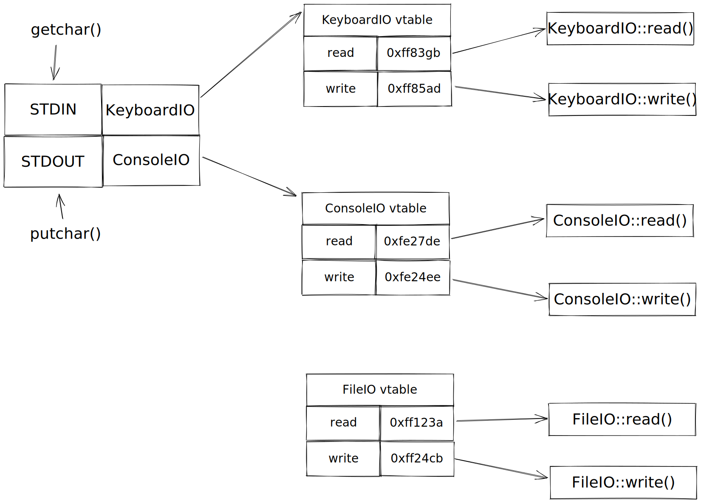

<!-- omit in toc -->
# Object-oriented Design

- [Perpetual inexperience in the industry](#perpetual-inexperience-in-the-industry)
- [Symptoms of bad code](#symptoms-of-bad-code)
  - [Rigidity](#rigidity)
  - [Fragility](#fragility)
  - [Non-reusability](#non-reusability)
- [The common trait of the symptoms](#the-common-trait-of-the-symptoms)
- [Flow of control and compile-time dependency](#flow-of-control-and-compile-time-dependency)
- [Object-oriented (OO) languages](#object-oriented-oo-languages)
  - [Encapsulation](#encapsulation)
  - [Inheritance](#inheritance)
  - [Polymorphism](#polymorphism)
- [How does polymorphism help?](#how-does-polymorphism-help)
- [References](#references)

This post is intended to be a detailed summary of the principles behind object-oriented design which serves as the foundation for the [[solid-principles]]. This specific explanation of the topic helps in unlocking higher understanding of why object-oriented design is such an important thing when designing software.

## Perpetual inexperience in the industry

As the field of software engineering grows, the population of programmers grows at a rapid pace. Martin guesses that the population of programmers doubles roughly every 5 years. He calls out that there's an implication for the industry where half the current programmers in the field has less than 5 years experience. This implication suggests that it's commonplace in the industry for the same mistakes to be made all the time (alluding to the mistakes that junior programmers make; Martin is a bit more blunt here and just calls it "bad code").

Bad code obviously slows us down significantly and yet we can't seem to avoid writing bad code. Martin takes a subtle jab at one of the more common reasons for that in that programmers typically rush through a problem just to be finish it and release it out into production as fast as possible (not such a surprise as there are tendencies for engineering cultures to prefer quantity or quality). There's irony in that approach as other things such as poor understandability and buggy behavior catches up sooner or later and waters down the initial accomplishments of the work.

## Symptoms of bad code

Martin poses the question:

> What are the symptoms of bad software?

There are 3 symptoms of bad software:

1. [Rigidity](#rigidity)
2. [Fragility](#fragility)
3. [Non-reusability](#non-reusability)

### Rigidity

The phenomenon of attempting to make a change in one module/class and then more changes that are dependent on that module/class has to occur in accordance in order to bring the system back into consistency.

### Fragility

The phenomenon of the code breaking in many places, despite making a change in only one place. The breaks occur in parts of the code that doesn't have any relationship to what was changed.

### Non-reusability

The phenomenon of not being able to reuse other code because that other code depends on other code that is not desirable. The desired parts of the code that you want can't be reused because it is strongly dependent on code that is not wanted.

## The common trait of the symptoms

The common trait of the aforementioned symptoms of bad code is **dependencies**. Code that is coupled in ways that is strange, bizarre, unwanted, etc. Rigidity occurs when the modules/classes dependent on each other in undesirable ways. Fragility occurs when code depends on data structures in undesirable ways. Non-reusability occurs when desirable code depends on other code in undesirable ways.

Martin claims that the bulk of design in software is managing dependencies. Figuring out where to slice dependencies to ensure that they don't end up running away in bizarre directions.

How do we accomplish that?

## Flow of control and compile-time dependency

Martin illustrates the concept of flow of control and compile-time dependency with a simple diagram between two modules:


If you have two modules `M` and `N` and `M` calls a function `f` that lives in `N`, the following can be said:

- The flow of control goes from `M` to `N` i.e. the run-time behavior.
- `M` depends on `N` i.e. the compile-time behavior.

This is a universal truth in languages such as C, which is a **not** an object-oriented programming language. In order for a module to call another, it has to know about the other module. The knowledge of other modules is apparent during compile-time as there is an import statement in the calling module. In this case, module `M` would have a statement in its source code that explicitly mentions module `N`.

Expanding the above example to a more realistic example, a function call tree of an application:


A typical function call tree starts with a top-level module i.e. `main` and then proceeds with calling progressively lower-level modules. In the above diagram, it's illustrated going from high-level (`HL`) to mid-level (`ML`) to terminal low-level (`LL`) modules).

In conclusion, higher-level modules know about lower-level modules. However, having higher-level modules know about lower-level modules violates [[inversion of control]]. Martin ties this pitfall as a primary reason of what makes code difficult to understand; he alludes that high-level modules knowing about lower-level modules leads to intermingling of details at various abstraction levels which makes it difficult to understand what's really happening at a high-level policy. Additionally, if there's ever a change that occurs at a low-level module, that module and everything that depends on it will need to be recompiled and redeployed. Martin argues that high-level policy should be immune from implementation details.

Linking it back to the symptoms of bad code:

- Rigidity happens when there's coupling down towards implementation details.
- Fragility happens when a change happens in a lower-level module that potentially breaks things in a high-level policy.
- Non-reusability happens when high-level policies are tightly coupled towards undesirable lower-level details.

## Object-oriented (OO) languages

Martin calls out that almost all modern programming languages are OO languages. It wasn't always like that in the past with languages such as C, Pascal, COBAL, etc. What was so special about OO languages that propelled them into the mainstream languages of today?

Martin proceeds to go into details about the three principles that make OO languages.

1. Encapsulation
2. Inheritance
3. Polymorphism

These principles are observed in the context of was it possible to achieve in C.

### Encapsulation

Martin calls out that C provided perfect encapsulation. In C, you were able to forward declare data structures and functions in a header (`.h`) file without having to implement them. The implementation could then live in a separate `.c` file. Users of your code would only include the header file in their own code and that's all they would have access to; they would not be able to see the implementation details.

```C
// foo.h
#ifndef FOO_H
#define FOO_H

int foo(int x);

#endif // FOO_H


// foo.c
#include "foo.h"

int foo(int x)
{
  return x + 2;
}


// main.c
#include <stdio.h>
#include "foo.h"

int main()
{
  int y = foo(3);
  return 0;
}
```

This is textbook encapsulation as none of the implementation details or the values of the data structures are exposed.

### Inheritance

A common approach that was employed in C was type pruning, which is a technique of declaring data structures in a way such that the differing members were at the end and then we could cast pointers going from child to parent types.

```c
struct base_class {
  int x;
}

struct derived_class {
  struct base_class base;
  int y;
}

struct derived_class2 {
  struct base_class base;
  int z;
};

int main() {
  struct derived_class d;
  struct derived_class2 d2;

  struct base_class *b1, *b2;

  b1 = (struct base_class *)&d;
  b2 = (struct base_class *)&d2;
  b1->x = 10;
  b2->x = 100;
}
```

Inheritance could be implemented using the technique illustrated above, even though it may not have been the most convenient.

### Polymorphism

Martin posed the following snippet of an over-simplified version of the UNIX copy program:

```c
void copy() {
  while((c = getchar()) != EOF) {
    putchar(c);
  }
}
```

Two things to note:

- `getchar()` reads a character from STDIN
- `putchar(c)` writes a character to STDOUT

The UNIX copy program simply reads from STDIN and writes to STDOUT. In UNIX-based systems, STDIN defaults to the keyboard and STDOUT defaults to the console. However, an important detail is that even though STDIN and STDOUT has their respective defaults, **it can be anything.** Instead of reading input from the keyboard, we could opt to read in input from a file. Instead of writing output to the console, we could write the output to a file. In short, `getchar()` and `putchar(c)` are polymorphic methods.

How is this polymorphism implemented? It turns out it's done in the following way.

Every I/O driver written in C needs to have 5 functions with well-established signatures implemented:

- `read()`
- `write()`
- `open()`
- `close()`
- `seek()`

The operating system would store pointers to these functions in a table. Anytime `getchar()` is called, the flow of control would go to the aforementioned table for STDIN and lookup the location of the `read()` function and invoke it (this is essentially the same concept as virtual tables in C++). It is possible for one to manipulate this table to point to different I/O drivers in order to read from or write to different sources. Hence, we can change the behavior of the above `copy()` program without changing the program itself.

Roughly illustrating what this looks like:



Polymorphism in this manner wasn't done much in C due to how dangerous it was. It relied on creating and loading a table of function pointers and everyone had to be a good citizen and call functions through this table. Anyone that violated those rules would mean a huge problem. However, the critical flaw was there was no way to enforce this behavior in the language itself. This is one of the primary reasons why C is not considered an OO language.

## How does polymorphism help?

With OO languages, polymorphism came out of the box and it became very cheap, easy and safe to use. Polymorphism provides an interesting mechanism for handling the problem of high-level modules knowing about low-level modules.

With polymorphism, the [diagram](#flow-of-control-and-compile-time-dependency) of a module calling another module can now be changed to the following:


Rather than having module `M` call the lower-level module `N` directly, we can have an interface `I` that declares the function `f`. Module `M` calls the function `f` on the interface and module `N` derives from the interface and implements `f`. The flow of control still goes from `M` to `N` but now the compile-time dependency goes against the flow of control. This is what polymorphism enables. **It gives the ability to invert the compile-time dependency while still preserving the flow of control**.

Going back to the application function call tree, this means we can take any of the red arrows and invert them as needed:


Having this power means we can **control the dependencies** within the architecture of our application. We now have the ability to avoid the symptoms of bad code.

The key takeaway is this:
> Object-oriented design is about managing dependencies; by selectively inverting key dependencies within your architecture, you can avoid rigidity, fragility, and non-reusability.

## References

- Robert "Uncle Bob" Martin's talk about [[solid-principles]]
  - <https://www.youtube.com/watch?v=QHnLmvDxGTY>
- Modeling inheritance in C
  - <https://stackoverflow.com/a/1249571>
- Virtual tables in C++
  - <https://pabloariasal.github.io/2017/06/10/understanding-virtual-tables/>
