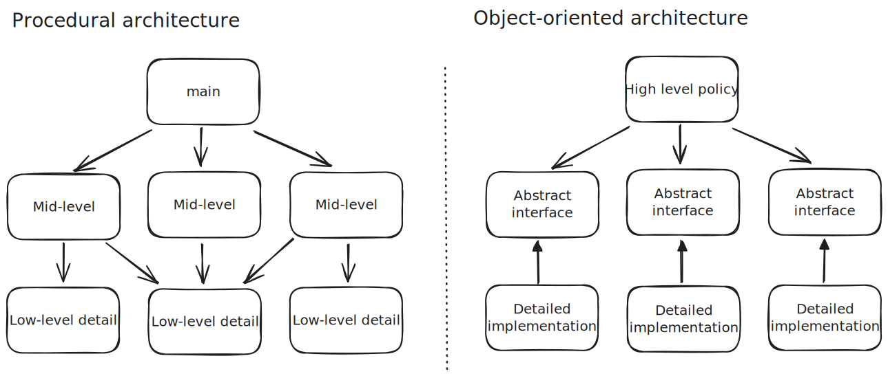
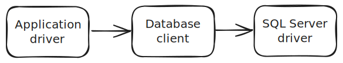
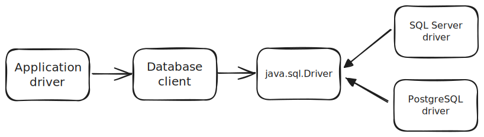

# Dependency inversion principle

The dependency inversion principle is the final letter of the [[solid-principles]].

## Meaning

Robert Martin states this principle as "Depend upon abstractions. Do not depend upon concretions".

This principle is the primary mechanism of [[object-oriented-design]], as the entire purpose of it is to manage dependencies. This means that modules in an application should depend on interfaces and abstract functions and classes and not instantiations of specific implementations.

## Example

JDBC driver implementations are an example of the application of the dependency inversion principle.

For each database vendor, there is a need to have a JDBC-compliant driver implementation that permits a Java application to be able to communicate with the database. There are vendor-specific details that often have to be dealt with in each driver's implementation. However, from the perspective of the Java application, it's primary concern should be that it's interacting with a relational database; it doesn't really care about what specific technology of the database is.

If we pretend that we have a simple procedural application that talks to a SQL Server database, it might look something like this.

Let's suppose that there was an ask from the business to change to another database vendor due to a licensing issue that makes it to expensive to continue using the existing database vendor. It is immediately clear that the `Database client` and `SQL Server driver` modules are impacted. Depending on how much detail the `Application driver` module has that is passed to `Database client`, it too can also be impacted and requires change.

A different architecture that leverages the dependency inversion principle makes the problem of switching database vendors a trivial task. The key is to have concrete database driver implementations depend on an abstraction, [`java.sql.Driver`](https://docs.oracle.com/javase/8/docs/api/java/sql/Driver.html).

We can see that both the `Database client` and the vendor-specific JDBC drivers depend on the `java.sql.Driver` abstraction. In the event of changing the database vendor, there is no significant code changes needed because the `Database client` depends on a well-established interface that is independent of the technology. There is also no work to be done on the various driver implementations as they are agnostic of any higher-level policy.

In effect, switching which database vendor the application communicates with is switching to the desired driver to the application's classpath.

[//begin]: # "Autogenerated link references for markdown compatibility"
[solid-principles]: solid-principles.md "SOLID principles"
[object-oriented-design]: ..%2Fobject-oriented-design%2Fobject-oriented-design.md "Object-oriented Design"
[//end]: # "Autogenerated link references"
